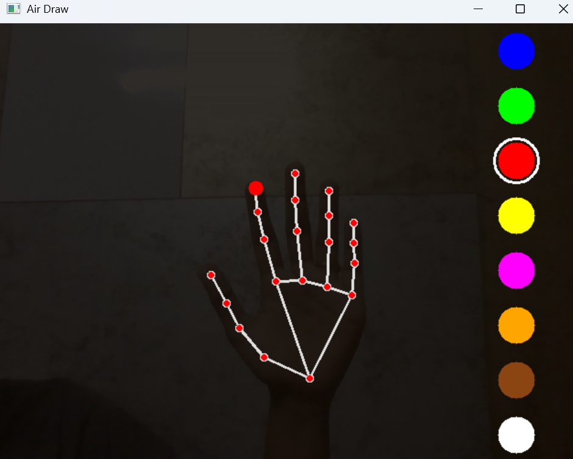
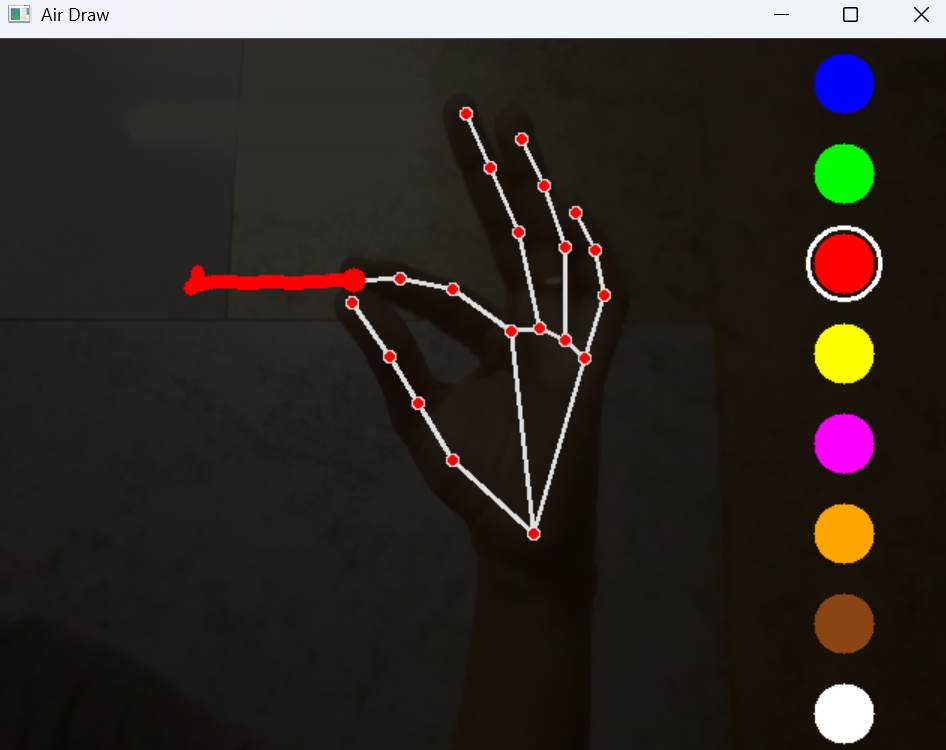
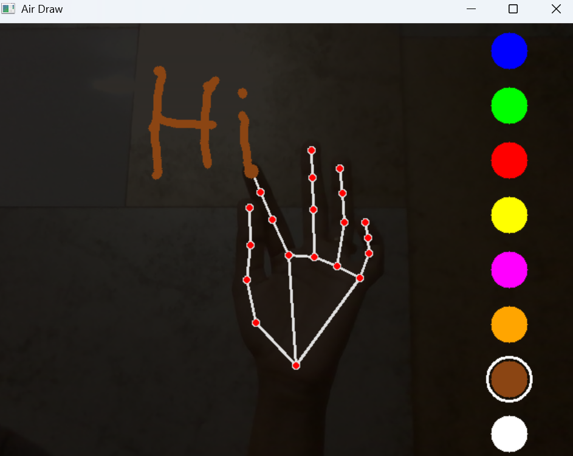

# Air-Drawing-Using-Hand-Gestures ✋🎨

Draw in the air using hand gestures with real-time hand tracking powered by Python, OpenCV, and MediaPipe. 

## Features

- ✋ Real-time hand tracking with 21 hand landmarks
- 🖊️ Pinch gesture (thumb + index finger) to draw in the air
- 🎨 8 different colors with a vertical color selection bar
- 🖥️ Virtual drawing canvas
- ✨ Smooth cursor movement for better drawing experience
- 🧹 Clear canvas using keyboard shortcuts

## Technologies Used

- Python
- OpenCV
- MediaPipe
- NumPy

## Demo Controls

| Action | How |
|---|---|
| Draw | Pinch thumb + index finger together and move your hand |
| Change color | Point your index finger at a color circle on the right-side bar |
| Clear canvas | Press `C` or `Space` |
| Quit | Press `Q` or `Esc` |

<p align="center">
  
  
  
</p>

## Project Structure

```
air-drawing-using-hand-gestures/
├── main.py          # Main application logic and webcam handling
├── hand.py          # MediaPipe hand tracking and landmark detection
├── colors.py        # Color palette and color selection logic
├── requirements.txt
└── README.md
```

## Installation

Clone the repository:

```bash
git clone https://github.com/Sanjana-peddigari/air-drawing-using-hand-gestures.git
cd air-drawing-using-hand-gestures
```

Install dependencies:

```bash
pip install -r requirements.txt
```

## Usage

Run the application:

```bash
py main.py
```

A webcam window titled **"Air Draw"** will open. Show your hand to the camera, make a pinch gesture, and start drawing.

## How It Works

- The webcam captures live video frames using OpenCV.
- MediaPipe detects the hand and extracts 21 landmark points.
- The index fingertip is used as the drawing cursor.
- The distance between the thumb tip and index fingertip is calculated to detect the pinch gesture.
- When the pinch gesture is detected, the fingertip movement is converted into digital drawing strokes.
- The color palette allows users to change drawing colors using hand movement.
- Coordinate smoothing is applied to reduce hand jitter and provide smoother drawing.

## File Description

### hand.py
- Uses MediaPipe Hands to detect hand landmarks.
- Returns landmark coordinates for further processing.

### colors.py
- Stores available drawing colors.
- Creates the color selection bar.
- Detects color selection based on fingertip position.

### main.py
- Handles webcam input.
- Detects pinch gestures.
- Draws strokes on a virtual canvas.
- Combines the drawing with the live camera feed.

## Requirements

See [requirements.txt](requirements.txt):

- opencv-python
- mediapipe
- numpy
